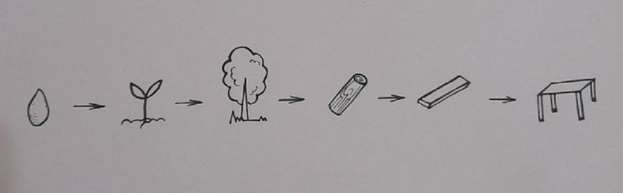
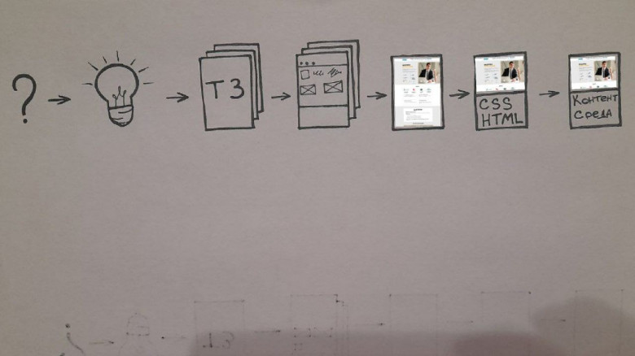
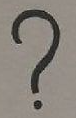
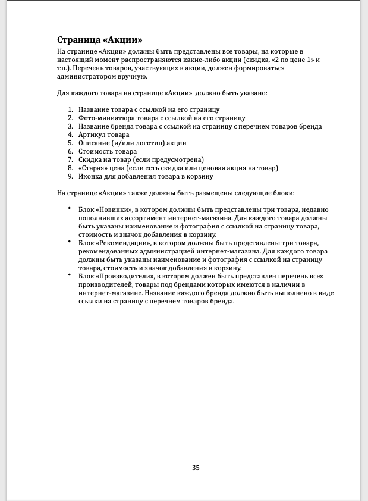

Как создать сайт с организационной точки зрения
===============================================

[Разработка веб-сайтов \*](https://habr.com/ru/hub/webdev/)[Анализ и проектирование систем \*](https://habr.com/ru/hub/analysis_design/)[Прототипирование \*](https://habr.com/ru/hub/prototyping/)[Управление проектами \*](https://habr.com/ru/hub/pm/)

Эта статья предназначена для широкого круга читателей. Но прежде всего, эта статья для тех, кто занимается непосредственно веб-разработкой, а также является руководителем или заказчиком этого проекта. Также она поможет тем, кто хочет развиваться в целом, понимать, как происходит процесс в целом, как разработать сайт, какие этапы необходимо пройти. 

Ниже я буду рассказывать о своем опыте. Сайтами я занимаюсь  уже порядка 15 лет, а вплотную – около 10 лет. Почему это так? Сейчас любая трансформация в организации, любые изменения в организации, так или иначе, касаются информационных систем. То есть, если мы хотим получить продажи, мы должны создать сайт. Если мы хотим повысить качества сервиса, то, скорее всего, это должно каким-то образом отображаться на сайте, например, в личном кабинете и как следствие ведет за собой создание нового сайта.

### Введение

Ко мне в последнее время достаточно часто стали обращаться с вопросом о том, как лучше переделать сайт или с просьбой доработать сайт с учетом изменившихся потребностей и современных требований. В последнее время я очень много занимаюсь сайтами. Более того, на протяжении более 15 лет я регулярно сталкиваюсь с такими задачами, практически всегда отвечаю на одни и те же вопросы, и даю, в принципе, одни и те же ответы.

Чаще всего у людей возникают сложности в понимании, какие действия необходимы, в каком порядке их выполнять, почему именно эти действия оказываются нужны. Для примера даже если в организации давно используют сайт, и есть понимание , что нужно сделать редизайн. Но не все понимают, что качественный редизайн просто так невозможно сделать. Для этого также понадобится изучить поставленные задачи, определить цели, провести анализ того, что уже существует, и создать техническое задание для реализации проекта.

### Немного о причинах появления этой статьи

Практика показывает, что заказчики чаще всего не совсем понимают, что им на самом деле надо, когда говорят об обновлении и редизайне сайта. Все думают, что редизайн - это на самом деле, создание совсем нового дизайна и тому подобные вещи. Люди путают веб-дизайн с дизайном, или наоборот, говорят, что это одно и то же. На самом же деле, в принципе, это очень близкие понятия, тем не менее, существует очень много отличий. Со временем, у меня сложился определенный опыт объяснения для заказчиков. И я для себя выработал определенную методику, согласно которой, работаю и создал уже не один десяток сайтов.

### Что такое создание сайта

Создание сайта (разработка сайта) - это процесс, очень похожий на создание мебели. Если мы возьмем мебель и сами составляющие этого конечного результата, можно понять, из чего она состоит - это с одной стороны. А с другой стороны, не совсем понятно, как именно из запчастей  тот или иной специалист получил готовый результат. 

Например, все мы знаем, что стол делают из досок. Если мы возьмем доску или брус, то они не особо напоминают готовую столешницу, особенно, если при ее изготовлении использовался декор. Сами доски делаются из бревна. Бревно снаружи с корой, пока оно дойдет до стадии доски, тоже пройдет время, так как необходима обработка. А само бревно - это, в принципе, посаженный саженец. Саженец и бревно связать достаточно сложно. Саженец - он такой хиленький, а тут – целое бревно. 

Создание мебели

Аналогичная ситуация с сайтом. Чтобы понять как создать необходимо понимать, как связаны между собой все элементы, из которых состоит процесс создания сайта, понимать процесс переходов от одного к другому. Каждый из элементов, которые появляются при переходе от одного этапа к другому, с одной стороны, несет в себе черты предыдущего этапа, материала, а другой стороны, уже обладает чем-то новым.

Для примера, если мы говорим о доске, то мы должны понимать, что она, с одной стороны, твердая, как бревно, но плоская и тонкая. Она уже отшлифована и совсем по-другому выглядит, но при этом, имеет черты того самого бревна. Вот такая, немного запутанная аналогия, но думаю, понятно.

### Этапы создания сайта

Конечно, проще всего написать фразу, которую сейчас очень часто используют в рекламе “создание сайта с нуля”. Казалось бы, что может быть проще и понятнее - просто сайт и все? Но это не так. Чем более подробно и грамотно труд по созданию сайта будет разделен на этапы, чем более узкоспециализированные специалисты будут привлекаться к каждому виду работ, тем вероятней что в конце получиться то что было задумано.

1.  Осознать потребность.
    
2.  Сформулировать идею.
    
3.  Создать техническое задание.
    
4.  Разработать схему расположения элементов.
    
5.  Нарисовать дизайн.
    
6.  Сверстать HTML шаблон.
    
7.  Запрограммировать  контентную среду.
    

Процесс создания сайта

#### 1\. Осознать потребность

Первое, что нам необходимо - это осознать потребность, то есть, человек, который является непосредственно заказчиком, это может быть владелец или руководитель предприятия, т.е. тот, кто оплачивает эту работу, кто будет являться выгодоприобретателем этой работы, в конечном счете, должен осознать потребность, и она должна быть описана. 

В принципе, потребность описывается, исходя из проблем: Например:

*   нужно продавать через интернет, 
    
*   требуется сэкономить время сотрудников,
    
*   слишком много времени уходит на общение с клиентом по документообороту,
    
*   покупатели недовольны скоростью ответа менеджера по продажам. 
    

Выше я привожу только некоторые самые распространенные проблемы, именно на их основе осознается потребность. Она является основанием для следующего этапа, а именно, для формулирования идеи.

#### 2\. Сформулировать идею

Что такое идея? Это ответ на вопрос, что необходимо сделать. Если у нас есть проблема, мы должны решить, что нам необходимо сделать для ее решения. 

Например, проблема или задача состоит в том, чтобы увеличить продажи. Мы решили продавать наш товар или услуги через интернет. Это самый простой пример проблемы, которую стремятся решить при помощи создания сайта Идея в этом случае так и должна звучать: создать сайт для продажи наших товаров в интернете. 

Еще один пример - решение проблемы затрат времени и недовольства клиентов при работе менеджеров с документами. Идея может быть такой: предоставить доступ к документам в личном кабинете на сайте. 

### Кто должен формулировать идеи? 

Идеи обычно формулирует либо заказчик, либо консультант или руководитель проекта - тот, кто уже создавал аналогичные решения, тот, кто уже знает, как правильно организовать работу. 

_Правильно сформулированная идея, понятная всем участникам процесса - это одна из самых главных вещей, которая в дальнейшем поможет получить то, что необходимо для решения той или иной задачи или проблемы._ 

Формулировать идею нужно четко, понятно и кратко - максимум, один абзац. Это может быть 200-300 символов или даже 150. Главное, чтобы идея была понятная и емкая, чтобы в конце, когда сайт будет создан, вы смогли понять, соответствует ли он сформулированной идее.

Идея оформляется в виде текста, после чего трансформируется в техническое задание.

#### 3\. Создать техническое задание

Что такое техническое задание? В данном случае, мы будем говорить о текстовом техническом задании. Это перечень необходимых решений, которые необходимо реализовать на основе того, каким должен в результате получиться сайт.

Техническое задание

Описание в техническом задании

Техническое задание создают специальные люди - это либо контент-менеджеры, либо копирайтеры, которые изучив сайты, и зная, что нам нем должно быть, его описывают. 

Например, в идее написано, что необходимо создать интернет-магазин по продаже столов. Специалист описывает количество страниц, которые обязательно должны быть, в том числе, о компании, главную страницу, контакты, интернет-магазины, страницы товаров, и так далее. Описывает, что должно быть на той или иной странице. 

Именно в текстовом техническом задании дается подробная расшифровка идеи плюс описываются технические требования, которым должен соответствовать конечный сайт.  Техническое задание может занимать, для примера, 30 000 символов. Чтобы было понятно, это около 25 страниц текста, где была описана каждая страница, какие элементы должны присутствовать на каждой из них, и так далее. Пример данного ТЗ я прикладываю. 

#### 4\. Разработать схему расположения элементов (прототипирование)

Техническое задание является основанием для создания схемы расположения элементов. Что такое схема расположения элементов? Этот этап еще называют прототипированием, и это определение не совсем верное, потому что прототипом все, что угодно можно назвать. 

Идею уже можно назвать прототипом, потому что прототип - это то, что было перед реализацией. Потому я предпочитаю термин схема расположения элементов.

Что это такое? Это когда мы берем и рисуем на основе нашего технического задания либо от руки, либо при помощи любого удобного инструмента схематическое изображение того, как должна выглядеть страница, с учетом требований, описанных в техническом задании. 

То есть, если в техническом задании написано, что страница должна иметь верхнее меню с корзиной, расположенной сверху, с большим баннером с предложением скидок на определенный стол, со ссылками на личный кабинет, и так далее, тогда дизайнер рисует макап. Также, этим может занимается UX дизайнер. 

Чем отличается простой дизайнер от дизайнера? UX дизайнер думает о том, как должны быть расположены элементы, но не столько с точки зрения не внешнего вида, а ориентируясь, прежде всего, на взаимодействие элементов и их расположение непосредственно на странице. 

Ниже вы видите примеры такой схемы, созданной от руки и нарисовано и с помощью Balsamiq Wireframes .  

Прототип созданный от руки

Прототип Balsamiq Mockup

Почему я рекомендую использовать Balsamiq Wireframes? С одной стороны, он имеет очень большое количество элементов, с другой стороны, там используются сам внешний вид этих элементов, когда вы рисуете, как бы, от руки. Они легче воспринимаются, чем формализованный и строгий вариант оформления схемы расположения элементов. 

#### 5\. Нарисовать дизайн

После того, как схема расположения элементов создана и согласована, мы отдаем ее дизайнеру. И дизайнер, исходя из того, что написано в ТЗ, запрашивает и собирает необходимые данные, после чего рисует уже сам дизайн этого сайта - то, как он должен выглядеть. 

Готовый дизайн сайта

И на этом этапе важно понимать, чем веб-дизайн отличается от обычного дизайна. С одной стороны, работа по созданию обычного и веб-дизайна очень похожа, это в любом случае, прорисовка картинки. С другой, имеются и важные отличия.

Когда дизайнер рисует то, каким должен быть сайт, он должен понимать, как это можно реализовать, исходя из возможностей заказчика. Потому что можно нарисовать все, что угодно - какие-то красивые элементы, переходы, этапы. Например, придумать, что здесь будет переход, а тут - всплывающее окно, на которое пользователь сможет нажать, чтобы поиграться, покататься на машинке и т.д. Но если это не предусмотрено в техническом задании и схеме расположения элементов, рисовать подобные вещи не стоит.

Дизайнер, когда рисует буклет, особо не ограничивая себя. Конечно, и тут есть определенные правила и требования, но они не столь жесткие. Веб-дизайнер обязан постоянно помнить о техническом задании, а также понимать техническую реализуемость того или иного элемента. Конечный результат - это файл формата psd или фигма, т.е. графический файл в любом формате, который можно будет отдать далее в работу по созданию внешнего вида сайта.

Дизайн в Figma

#### 6\. Сверстать HTML шаблон

Затем на основе прорисованного дизайна создается html шаблон (это также называется версткой сайта или шаблона). Потому готовый дизайн мы отдаем это верстальщику. 

Верстальщик - это тот человек, который располагает знаниями о том, как  необходимо сверстать тот или иной элемент, нарисованный в веб-дизайне, таким образом, чтобы он отображался в браузере, так же, как и нарисован. 

Не должно быть особых отличий, но при этом необходимо следующее: не нужно требовать от верстальщика пиксель перфект, то есть, бывает, что заказчики требуют провести попиксельное сравнение. Это неправильно, потому что есть вещи, которые дизайнер может просто не учесть. 

Например, дизайнер сделал 11 пикселей, а у нас в верстке мы используем BOOTSTRAP. И мы не можем сделать 11 пикселей, у нас всегда будет какая-то относительная величина. Может быть, 10 или 12, в зависимости от того, что именно было указано в колонке. Соответственно, здесь такая точность, в принципе, не нужна. Главное, чтобы было изображено в соответствии с дизайном. Но при этом я рекомендую ориентироваться больше на зрительное восприятие, а не на, так называемый, пиксель перфект.

Файлы верстки

Верстка с BOOTSTRAP

#### 7\. Запрограммировать  контентную среду

После того, как создан html шаблон, следующим этапом будет программирование контентной  среды. 

Файлы верстки контентной  среды на примере Drupal 9

Контентная среда – это среда, в которой вступает в роль так называемый контент. Если мы до этого на контент особого внимания не обращали, то пришло время сделать так, чтобы наш сайт должен стать живым. 

Когда вы создали шаблон в виде html страницы, там может быть любая информация. Часто на этом этапе вместо точной информации об услугах используется какая-то “рыба” или нарисована какая-то произвольная фотография стола с надписью. Но для того, чтобы сайт работа, чтобы на нем отображалась реальная и актуальная информация, контент должен ожить. И чтобы он ожил, мы должны наш html шаблон адаптировать для конкретной среды. И вот здесь, как раз-таки, в дело вступает программист. 

Верстка контентной  среды

На примере Drupal: берем верстку, создаем типы материалов, сами материалы, необходимые элементы для того, чтобы они отображались на странице, и программист задает эти стили. То есть, берет стили из html шаблона, и получает конечный результат, который как раз-таки, будет являться тем сайтом, которым будут пользоваться например, покупатели столов.

### Зачем нужен руководитель проекта

Как видите, над сайтом работают разные специалисты. А потому, кто-то должен все это контролировать, распределять обязанности, проверять результат. Это все должен делать, как раз-таки, руководитель проекта создания сайтов. 

Руководитель проекта – это специализированный человек, который, как любой руководитель, должен знать возможности той или иной технологии, того или иного специалиста, которого он будет приглашать, и с каким работает, и ограничения той или иной технологии и того или иного специалиста. Например, я, как руководитель проекта автоматизации, не знаю досконально Drupal, но я знаю, что он может, а что нет, и что немаловажно, знаю ограничения. Соответственно, исходя из этого, я руковожу этим процессом.    

### Специалисты

Необходимо понимать, что каждый специалист – это специалист в своей сфере. Т.е. если вы привлекаете к сотрудничеству людей по той схеме, которую я описал в статье, то у вас каждым этапом занимается отдельный специалист. И каждый из них будет использовать отдельный инструмент.

При этом если вы нанимаете специалиста, не стоит ему диктовать, какой инструмент он обязан использовать. Доверяйте профессионализму тех людей, с которыми принимаете решение работать.

Просто представьте, что вы нанимаете электрика и начинаете диктовать ему в процессе, какую отвертку, какой амперметр или тестер использовать, вы не получите ничего, кроме раздражения. При таком подходе вы можете не только забыть о долгосрочном сотрудничестве, скорей всего, если вы проявите подобные качества еще на этапе оценки, электрик просто развернется и уйдет, так как сделает вывод, что вы – неадекват, который лезет не в свое дело, а потому сотрудничество лучше и не начинать.

Потому намного лучше четко описать, что именно вы хотите получить, после чего контролировать полученный результат, чем пытаться вникать во все нюансы и диктовать специалисту, как и что делать. Само собой, из этого правила есть единственное исключение – вы можете выбирать инструменты и даже диктовать последовательность действий, если вы – профессионал, который нанимает помощников для решения вспомогательных задач. Иначе, контролируйте результат, а сам процесс оставьте тем, кто будет выполнять работу.

Даже после того, как я специально прошел курсы программирования, изучил верстку, некоторые CMS и языки программирования, я при работе с командой даю определенные советы, но не более того.

Кроме того, если вы не работаете со сложившейся командой, а нанимаете для каждого этапа отдельного специалиста, нужно понимать, что все мы стремимся заработать как можно больше денег. А потому, например, дизайне может также предложить свои услуги в верстке. Но настоящих «специалистов на все руки» крайне мало. А потому чаще всего хороший дизайнер оказывается посредственным верстальщиком и наоборот. В итоге, никто не предскажет, насколько качественной и валидной получится верстка, выполненная дизайнером. А от верстальщика вы вряд ли дождетесь интересных решений, выходящих за рамки стандартных готовых шаблонов.

Кстати, именно по этой причине дизайнеры так любят работать с Тильдой, так как там верстка, по сути, встроена в систему. Но на практике ее валидность также часто оказывается под вопросом. И нужен профессионал, чтобы увидеть важные ошибки.

Потому не стоит экономить на специалистах. Конечно, дизайнер сделает, что и как сумеет. Но вам нужно качество на каждом из этапов. А потому разделяйте их и отдавайте каждый этап в работу соответствующему специалисту.

Так же про работу со специалистами можно почитать в статье:

[О единстве и борьбе противоположностей в бизнесе. Взаимоотношения заказчика с исполнителем](https://habr.com/ru/company/trinion/blog/345676/)

### Вопросы и ответы

#### Можно ли «перепрыгивать» некоторые этапы?

Нет, нельзя. Вы можете решить сами или по договоренности с заказчиком, что на самом деле, все и так понятно, и не нужна ни идея, ни техническое задание, просто создаете сайт и все. Но на самом деле, так поступают обычно, если создают сайт на каком-то конструкторе, например, на Tilda, или на очень простой CMS (WordPress, Webflow  и подобные), в тех случаях, когда создают «простой сайт за несколько дней и 1000 рублей».

В этом случае обычно сразу выбирают какой-то шаблон, который «просто понравился», и быстро переходят к работе с контентом. Но на самом деле, эта работа оказывается бесконечной, так как постоянно «что-то будет не так», и она не приносит результата. Потому что если нет поставленной цели, то и стремиться не к чему. Вам не с чем сравнивать, достигнут ли результат, окончена ли задача.

Вам могут пообещать «мы создадим для вас хороший сайт на Tilda за 1000 или даже 20 000 рублей». Но что такое хороший сайт? Вы уверены, что ваше понимание и понимание людей, которые будут этот сайт делать, совпадает? Или предложат даже готовое тематическое решение, например, «создадим сайт для консалтинга». А каким должен быть сайт для консалтинга? Если нет поставленной цели, нет сформулированной идеи, то вам будет не с чем сравнивать, чтобы понять, хороший ли это сайт и поможет ли он вам в решении тех задач, которые вы бы хотели реализовать.

Получается, бесконечная работа.  На самом деле, исполнители, которые «просто делают сайт», все описанные этапы используют, но не озвучивают и не согласовывают с вами. Т.е. они из своих заготовок и со своим пониманием идеи выбирают прототип, реализуют на его основе сайт. Но заказчик не принимает в этой работе никакого участия. По итогу, вы получаете готовый сайт, который далеко не всегда совпадает с тем, что вам было действительно нужно. И тогда придется вносить изменения в уже существующий сайт, а это всегда дольше, сложнее и дороже, чем четко поставить цели, задачи и согласовать прототип.

#### А что вы скажете о SEO?

Очень важно понимать, что SEO – это сложное понятие. С одной стороны, оно включает в себя широко известные технические требования, которые обязательно должны учитываться при создании сайтов. Об этом пишут очень много даже сами поисковые системы – как технически должны оформляться страницы, какие ошибки лучше не допускать и т.д. С другой стороны, ни одна поисковая система не расскажет вам, как работает алгоритм ранжирования, соответственно, вы не можете точно знать, как сделать, чтобы страницы вашего сайта ранжировались, и заранее на 100% сделать сайт таким, чтобы он вошел в ТОП выдачи.

Потому с точки зрения SEO на этапе создания сайта самое важное:

1.  Создавать качественный контент (уникальные статьи, полезные публикации, грамотные описания и т.д.)
    
2.  С технической точки зрения создавать сайт таким, как того требуют спецификации от поисковых систем.
    

Всевозможные манипуляции поисковой выдачей – это просто не реально, потому при создании сайта не стоит их даже закладывать в бюджет.

Интересная статья по теме SEO:

[HTML5 и алгоритм разметки документов](https://habr.com/ru/post/645471/)

#### Как набраться опыта?

Вы можете быть руководителем бизнеса, для которого пришло время создавать сайт. Можете быть дизайнером, который будет принимать участие в создании сайта. Можете быть, как я, консультантом, к которому обращаются за помощью при создании сайта, так как в процессе сотрудничества я уже хорошо изучил бизнес, мне не нужно пояснять, как и что работает, и зачем все это нужно. В любом случае, набраться опыта можно единственным методом – делать, пробовать, экспериментировать.

Я уже 15 лет учусь и набираюсь опыта на практике. И могу поделиться собственным лайфхаком – экспериментируйте на себе. Лично мой сайт прошел уже, наверное, около 20 итераций. Я приложу некоторые варианты его дизайна, чтобы вы могли оценить, насколько по-разному выглядел мой сайт в разное время. Что только я ни пробовал! И разные дизайнерские решения, и разные движки – WordPress, Tilda, Webflow и некоторые другие. Лично я остановился в итоге на DRUPAL по целому ряду причин, среди которых не последнее место занимает то, что мне лично DRUPAL очень нравится.

Почему я выбрал именно Drupal можно почитать в моей статье:

[Обзор CMS DRUPAL 9](https://habr.com/ru/post/514438/)

Потому, повторюсь, других путей нет, чтобы получить опыт, нужно только работать, что-то делать, а также быть рядом с тем, кто этим занимается постоянно и может поделиться опытом на практике.

Закрыть

Теги:

*   [создание сайтов](https://habr.com/ru/search/?target_type=posts&order=relevance&q=%5B%D1%81%D0%BE%D0%B7%D0%B4%D0%B0%D0%BD%D0%B8%D0%B5%20%D1%81%D0%B0%D0%B9%D1%82%D0%BE%D0%B2%5D)
*   [разработка сайтов](https://habr.com/ru/search/?target_type=posts&order=relevance&q=%5B%D1%80%D0%B0%D0%B7%D1%80%D0%B0%D0%B1%D0%BE%D1%82%D0%BA%D0%B0%20%D1%81%D0%B0%D0%B9%D1%82%D0%BE%D0%B2%5D)
*   [web дизаин](https://habr.com/ru/search/?target_type=posts&order=relevance&q=%5Bweb%20%D0%B4%D0%B8%D0%B7%D0%B0%D0%B8%D0%BD%5D)
*   [техническое задание](https://habr.com/ru/search/?target_type=posts&order=relevance&q=%5B%D1%82%D0%B5%D1%85%D0%BD%D0%B8%D1%87%D0%B5%D1%81%D0%BA%D0%BE%D0%B5%20%D0%B7%D0%B0%D0%B4%D0%B0%D0%BD%D0%B8%D0%B5%5D)

Хабы:

*   [Разработка веб-сайтов](https://habr.com/ru/hub/webdev/)
*   [Анализ и проектирование систем](https://habr.com/ru/hub/analysis_design/)
*   [Прототипирование](https://habr.com/ru/hub/prototyping/)
*   [Управление проектами](https://habr.com/ru/hub/pm/)
